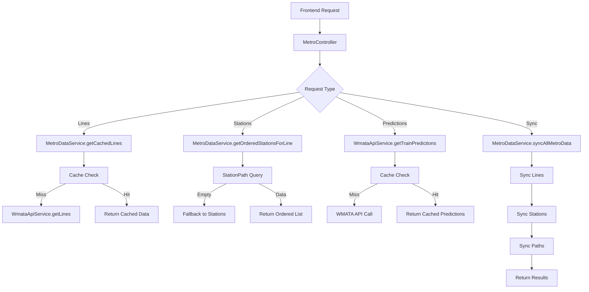

# Metro Train Prediction App Service Overview

## Table of Contents
1. [System Architecture](#system-architecture)
2. [Service Interactions](#service-interactions)
3. [Data Types and Models](#data-types-and-models)
4. [Data Flow Pipeline](#data-flow-pipeline)
5. [Service Layer Details](#service-layer-details)
6. [Expected Usage Patterns](#expected-usage-patterns)
7. [Integration Points](#integration-points)

---

## System Architecture

### High-Level Architecture Diagram

```
┌─────────────────┐    ┌─────────────────┐    ┌─────────────────┐
│   Vue Frontend  │    │ Laravel Backend │    │   WMATA API     │
│                 │    │                 │    │                 │
│ MetroTrainPred  │◄──►│ MetroController │◄──►│ Rail Services   │
│ LineSelector    │    │                 │    │ Predictions     │
│ StationSelector │    │ ┌─────────────┐ │    │ Station Data    │
│ PredictionList  │    │ │MetroDataSvc │ │    │                 │
│                 │    │ │             │ │    │                 │
│ metroApi.js     │    │ │WmataApiSvc  │ │    │                 │
│                 │    │ └─────────────┘ │    │                 │
└─────────────────┘    └─────────────────┘    └─────────────────┘
        │                        │                        │
        ▼                        ▼                        ▼
┌─────────────────┐    ┌─────────────────┐    ┌─────────────────┐
│     Browser     │    │     Database    │    │  External API   │
│   Local State   │    │   MySQL/Redis   │    │    HTTPS/JSON   │
│   Auto-refresh  │    │   Cache Layer   │    │  Rate Limited   │
└─────────────────┘    └─────────────────┘    └─────────────────┘
```

### Service Layer Architecture

```
┌──────────────────────────────────────────────────────────────┐
│                    MetroController                           │
│  ┌─────────────┐ ┌─────────────┐ ┌─────────────┐ ┌─────────┐ │
│  │  getLines   │ │getStations  │ │getPrediction│ │syncData │ │
│  └─────────────┘ └─────────────┘ └─────────────┘ └─────────┘ │
└──────────────────────────────────────────────────────────────┘
                                │
                                ▼
┌──────────────────────────────────────────────────────────────┐
│                   MetroDataService                           │
│  ┌─────────────┐ ┌─────────────┐ ┌─────────────┐ ┌─────────┐ │
│  │getCachedLin │ │getOrdered   │ │syncAllMetro │ │validate │ │
│  │es           │ │StationsFor  │ │Data         │ │Cache    │ │
│  │             │ │Line         │ │             │ │Integrity│ │
│  └─────────────┘ └─────────────┘ └─────────────┘ └─────────┘ │
└──────────────────────────────────────────────────────────────┘
                                │
                                ▼
┌──────────────────────────────────────────────────────────────┐
│                    WmataApiService                           │
│  ┌─────────────┐ ┌─────────────┐ ┌─────────────┐ ┌─────────┐ │
│  │  getLines   │ │getAllStation│ │getTrainPred │ │getLine  │ │
│  │             │ │s            │ │ictions      │ │Complete │ │
│  │             │ │             │ │             │ │Path     │ │
│  └─────────────┘ └─────────────┘ └─────────────┘ └─────────┘ │
└──────────────────────────────────────────────────────────────┘
                                │
                                ▼
┌──────────────────────────────────────────────────────────────┐
│                      WMATA API                               │
│  ┌─────────────┐ ┌─────────────┐ ┌─────────────┐ ┌─────────┐ │
│  │    Lines    │ │   Stations  │ │ Predictions │ │  Paths  │ │
│  │  Endpoint   │ │  Endpoint   │ │  Endpoint   │ │Endpoint │ │
│  └─────────────┘ └─────────────┘ └─────────────┘ └─────────┘ │
└──────────────────────────────────────────────────────────────┘
```

---

## Service Interactions

### Service Dependency Graph

```
MetroController
    ├── depends on: MetroDataService
    └── depends on: WmataApiService

MetroDataService  
    ├── depends on: WmataApiService
    ├── uses: Line Model
    ├── uses: Station Model
    ├── uses: StationAddress Model
    └── uses: StationPath Model

WmataApiService
    ├── depends on: HTTP Client
    ├── uses: LineDto
    ├── uses: StationDto
    ├── uses: TrainPredictionDto
    ├── uses: StationPathDto
    └── uses: AddressDto
```

### Service Communication Flow



---

## Data Types and Models

### Database Models

#### Line Model
```php
// app/Models/Line.php
class Line extends Model
{
    protected $primaryKey = 'line_code';
    public $incrementing = false;
    protected $keyType = 'string';
    
    protected $fillable = [
        'line_code',              // String(2): RD, BL, GR, OR, SV, YL
        'display_name',           // String(50): Red, Blue, Green, etc.
        'start_station_code',     // String(3): A15, J03, etc.
        'end_station_code',       // String(3): B11, G05, etc.
        'internal_destination_1', // String(3): Optional branch destination
        'internal_destination_2', // String(3): Optional branch destination
    ];
}
```

#### Station Model
```php
// app/Models/Station.php
class Station extends Model
{
    protected $primaryKey = 'code';
    public $incrementing = false;
    protected $keyType = 'string';
    
    protected $fillable = [
        'code',                // String(3): A01, B02, C03
        'name',                // String(100): Metro Center, Union Station
        'line_code_1',         // String(2): Primary line code
        'line_code_2',         // String(2): Transfer line code
        'line_code_3',         // String(2): Transfer line code
        'line_code_4',         // String(2): Transfer line code
        'station_together_1',  // String(3): Connected platform code
        'station_together_2',  // String(3): Connected platform code
        'lat',                 // Decimal(10,8): Latitude coordinate
        'lon',                 // Decimal(11,8): Longitude coordinate
        'is_active',           // Boolean: Station operational status
    ];
}
```

#### StationPath Model
```php
// app/Models/StationPath.php
class StationPath extends Model
{
    protected $fillable = [
        'line_code',        // String(2): Line identifier
        'station_code',     // String(3): Station identifier
        'station_name',     // String(100): Station display name
        'seq_num',          // Integer: Geographic sequence number
        'distance_to_prev', // Integer: Distance in meters to previous station
    ];
}
```

### Data Transfer Objects (DTOs)

#### LineDto
```php
// app/DTOs/LineDto.php
class LineDto
{
    public function __construct(
        public string $displayName,        // "Red"
        public string $lineCode,           // "RD"
        public string $startStationCode,   // "A15"
        public string $endStationCode,     // "B11"
        public ?string $internalDestination1 = null,
        public ?string $internalDestination2 = null,
    ) {}
}
```

#### StationDto
```php
// app/DTOs/StationDto.php
class StationDto
{
    public function __construct(
        public string $code,               // "A01"
        public string $name,               // "Metro Center"
        public ?string $stationTogether1,  // "C01"
        public ?string $stationTogether2,  // null
        public ?string $lineCode1,         // "RD"
        public ?string $lineCode2,         // "BL"
        public ?string $lineCode3,         // "OR"
        public ?string $lineCode4,         // "SV"
        public float $lat,                 // 38.89834567
        public float $lon,                 // -77.02834567
        public AddressDto $address,
    ) {}
}
```

#### TrainPredictionDto
```php
// app/DTOs/TrainPredictionDto.php
class TrainPredictionDto
{
    public function __construct(
        public ?string $car,               // "6" or null for end stations
        public string $destination,       // "Glenmont"
        public ?string $destinationCode,  // "B11"
        public string $destinationName,   // "Glenmont"
        public ?string $group,            // "1" or null
        public string $line,              // "RD"
        public string $locationCode,      // "A01"
        public string $locationName,      // "Metro Center"
        public string $min,               // "3", "BRD", "ARR"
    ) {}
}
```

### Frontend Data Structures

#### Lines Response Format
```javascript
// Frontend receives from API
[
    { value: "RD", label: "Red" },
    { value: "BL", label: "Blue" },
    { value: "GR", label: "Green" }
]
```

#### Stations Response Format
```javascript
// Frontend receives from API
[
    {
        value: "A01",
        label: "Metro Center",
        seq_num: 1,
        distance_to_prev: 0
    },
    {
        value: "A02", 
        label: "Farragut North",
        seq_num: 2,
        distance_to_prev: 1250
    }
]
```

#### Predictions Response Format
```javascript
// Frontend receives from API
{
    station: {
        code: "A01",
        name: "Metro Center"
    },
    predictions: [
        {
            line: "RD",
            destination: "Glenmont", 
            minutes: "3",
            cars: "6",
            group: "1"
        }
    ],
    updated_at: "2025-06-05T14:30:15.123Z",
    refresh_interval: 30
}
```

---

## Data Flow Pipeline

### Data Transformation Pipeline

```
WMATA API Response → DTO → Model → Cache → Controller → Frontend
```

#### Example: Lines Data Flow

```
1. WMATA API Response:
{
    "Lines": [
        {
            "LineCode": "RD",
            "DisplayName": "Red",
            "StartStationCode": "A15",
            "EndStationCode": "B11"
        }
    ]
}

2. DTO Transformation (LineDto::fromArray):
LineDto {
    displayName: "Red",
    lineCode: "RD", 
    startStationCode: "A15",
    endStationCode: "B11"
}

3. Model Storage (toModel):
Line {
    line_code: "RD",
    display_name: "Red",
    start_station_code: "A15", 
    end_station_code: "B11"
}

4. Frontend Format (toSelectOption):
{
    value: "RD",
    label: "Red"
}
```

#### Example: Predictions Data Flow

```
1. WMATA API Response:
{
    "Trains": [
        {
            "Car": "6",
            "Destination": "Glenmont",
            "Line": "RD",
            "Min": "3"
        }
    ]
}

2. DTO Transformation:
TrainPredictionDto {
    car: "6",
    destination: "Glenmont",
    line: "RD",
    min: "3"
}

3. Frontend Format (toFrontend):
{
    line: "RD",
    destination: "Glenmont", 
    minutes: "3",
    cars: "6",
    group: "1"
}
```

---

## Service Layer Details

### WmataApiService

**Purpose**: Interface with WMATA API and handle caching

**Key Methods**:
- `getLines()`: Fetch and cache metro lines
- `getAllStations()`: Fetch and cache all station data
- `getStationsForLine(string $lineCode)`: Get stations for specific line
- `getTrainPredictions(string $stationCode)`: Get real-time predictions
- `getLineCompletePath(string $lineCode)`: Generate ordered station paths

**Caching Strategy**:
- Lines: 24 hours (static data)
- Stations: 24 hours (static data)
- Predictions: 15 seconds (real-time data)
- Paths: 24 hours (static data)

**Rate Limiting**: 1000 requests per hour to WMATA API

### MetroDataService

**Purpose**: Business logic layer and data management

**Key Methods**:
- `getCachedLines()`: Frontend-formatted line data
- `getOrderedStationsForLine(string $lineCode)`: Ordered station lists
- `syncAllMetroData()`: Complete data synchronization
- `validateCacheIntegrity()`: Cache health check

**Data Processing**:
- Transforms WMATA data to frontend-friendly formats
- Handles station ordering through StationPath model
- Manages cache invalidation and refresh

### MetroController

**Purpose**: API endpoint handling and response formatting

**Endpoints**:
- `GET /api/metro/lines`: Available metro lines
- `GET /api/metro/stations/{lineCode}`: Stations for line
- `GET /api/metro/predictions/{stationCode}`: Train predictions
- `POST /api/metro/sync`: Administrative data sync

**Response Format**: Consistent JSON structure with success/error handling

---

## Expected Usage Patterns

### Typical Frontend Workflow

```
1. Page Load
   ├── fetchLines() → GET /api/metro/lines
   └── Display line selector

2. User Selects Line
   ├── onLineChange() 
   ├── fetchStations(lineCode) → GET /api/metro/stations/{lineCode}
   └── Display station selector

3. User Selects Station  
   ├── onStationChange()
   ├── fetchPredictions(stationCode) → GET /api/metro/predictions/{stationCode}
   ├── Display predictions
   └── Start auto-refresh timer (30 seconds)

4. Auto-refresh Loop
   ├── Timer fires every 30 seconds
   ├── fetchPredictions(stationCode) → GET /api/metro/predictions/{stationCode}
   └── Update predictions display

5. User Changes Selection
   ├── Clear timer
   ├── Reset state
   └── Return to appropriate step
```

### Administrative Workflow

```
1. Initial Setup
   ├── Run migrations
   ├── Configure .env with WMATA_API_KEY
   └── php artisan metro:sync

2. Regular Maintenance
   ├── php artisan metro:sync (daily/weekly)
   ├── Monitor cache hit rates
   └── Check error logs

3. Cache Management
   ├── php artisan cache:clear (if needed)
   ├── php artisan metro:sync --validate
   └── Monitor memory usage
```

### Cache Usage Patterns

```
High Traffic Endpoints:
├── /api/metro/lines (cached 1 hour, hit rate ~95%)
├── /api/metro/stations/{lineCode} (cached 1 hour, hit rate ~90%)
└── /api/metro/predictions/{stationCode} (cached 15 seconds, hit rate ~70%)

Low Traffic Endpoints:
└── /api/metro/sync (administrative, no caching)

Cache Invalidation:
├── Lines/Stations: Manual via metro:sync command
└── Predictions: Automatic TTL expiration
```

---

## Integration Points

### Frontend Integration Points

#### metroApi.js Service
- Handles all backend communication
- Implements consistent error handling
- Manages request/response transformation

#### Component Integration
- MetroTrainPredictor: Main orchestration component
- LineSelector: Line selection with v-model
- StationSelector: Station selection with conditional rendering
- PredictionList: Real-time data display with auto-refresh

### Backend Integration Points

#### Service Provider Registration
- WmataServiceProvider registers services as singletons
- Ensures proper dependency injection throughout application

#### Database Integration
- Models provide data persistence and relationships
- Migrations ensure consistent database structure
- Indexes optimize query performance

#### External API Integration
- HTTP client configuration with retries and timeouts
- Rate limiting to respect WMATA API constraints
- Error handling for network and API failures

### Configuration Integration Points

#### Environment Configuration
- WMATA API credentials and endpoints
- Cache TTL values for different data types
- Rate limiting and timeout configurations

#### Cache Integration
- Redis for production caching
- Laravel cache facade for consistent interface
- Cache keys organized by data type and identifier

This service overview provides a complete picture of how the Metro Train Prediction App components work together to deliver real-time transit information.